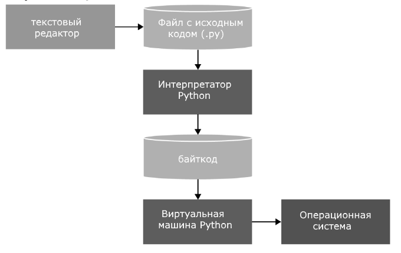

# Что такое Python

Python — высокоуровневый язык программирования общего назначения, ориентированный на повышение производительности разработчика и читаемости кода.

Python имеет поддержку самых различных парадигм программирования, в том числе объектно-ориентированной и функциональной парадигм.

Интерпретация программ. Для работы со скриптами необходим интерпретатор, который запускает и выполняет скрипт.
Python использует интерпретатор CPython.

Выполнение программы на Python выглядит следующим образом. Сначала мы пишим в текстовом редакторе скрипт с набором выражений. Передаем этот скрипт на выполнение интерпретатору. Интерпретатор транслирует код в промежуточный байткод, а затем виртуальная машина переводит полученный байткод в набор инструкций, которые выполняются операционной системой.

Python имеет динамическую типизацию.
Python - относится к динамическим языкам программирования, он также имеет автоматическое управление памятью.

