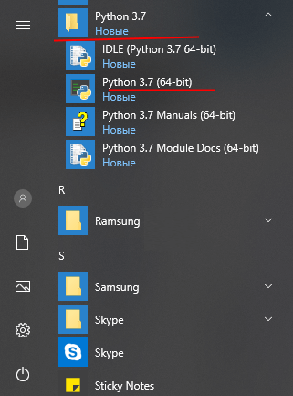

# Как установить Python и какие инструменты нужны для работы

Для его установки Python нужно перейти на сайт https://www.python.org/ и на главной станице в секции Downloads, нужно найти ссылку на загрузку последней версии языка.

Переходим по ссылке к странице с описанием последней версии языка. Ближе к низу на ней можно найти список дистрибутивов для разных операционных систем. Выберем пакет и загружаем его.

Далее делаем все по инструкции в установке

После установки в меню Пуск на ОС Windows мы сможем найти иконки для доступа к разным утилитам питона:

*Версии могут быть разные

## Инструменты

Для разработке на python подойдут многи IDE, но вот годный топ:
1) PyCharm - IDE разработана компанией JetBrains - [ссылка на PyCharm](https://www.jetbrains.com/ru-ru/pycharm/)
2) VSCode - IDE разработана компанией Microsoft (Советую ее использовать) - [ссылка на VSCode](https://code.visualstudio.com/)
3) Sublime text - редактор разработан Джоном Скиннером (хз, кто такой) - [ссылка на Sublime text](https://www.sublimetext.com/)

Главным преимуществом VSCode над PyCharm - цена лецензии, она бесплатная.
А Главными преимуществоми VSCode над Sublime:
- множество сторонних плагинов
- огромное комьюнити

