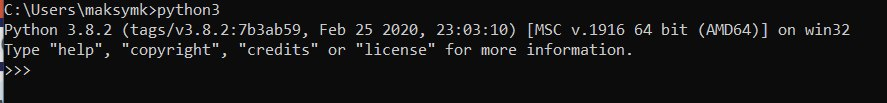
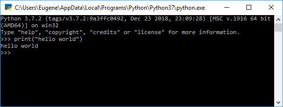

# Первая программа 

Первым делом откроем командную строку(терминал), если установка интерпритатора прошла успешно, мы можем ввести в консоль следущую команду "python3"

Должно получиться типа такого:

;

Далее введем команду 'print("hello world")'.
Для этой программы использовался метод print(), который выводит некоторую строку на консоль.

;

Еееее теперь мы хацкеры :)

## Создание файла программы

Теперь все сделаем не через терминал, а через файл

Создадим папку(проект) где удобно, в нем создадим файлик index.py (py - это расширение для питон файлов)

В самом файле мы пропишем след. команды

    name = input("Введите имя: ")
    print("Привет,", name)

Скрипт состоит из двух строк. Первая строка с помощью метода input() ожидает ввода пользователем своего имени. Введенное имя затем попадает в переменную name.

Вторая строка с помощью метода print() выводит приветствие вместе с введенным именем.

Теперь запустим командную строку/терминал и с помощью команды cd перейдем к папке, где находится файл с исходным кодом index.py, и запустим его через команду:

    python3 index.py

В терминал должно вывести строку Привет, <Ваше имя>

Поздравляю, ты сделал первую программу :)

