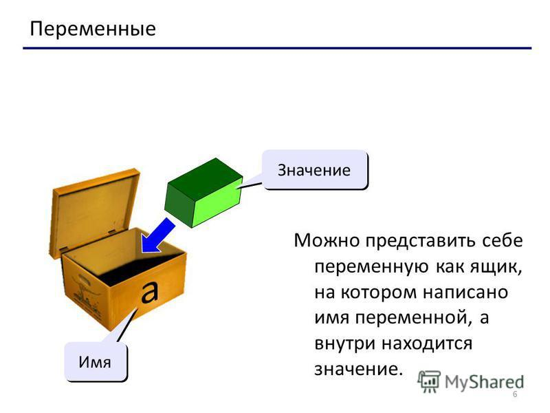

# Переменные и типы данных

Что такое переменная: 

Это поименованная, либо адресуемая иным способом область памяти, адрес которой можно использовать для осуществления доступа к данным. Данные, находящиеся в переменной (то есть по данному адресу памяти), называются значением этой переменной. (Из Википедии)

А теперь обыным языком

Переменную можно представить, как коробочку где хранятся данные, у переменной в обязательном порядке должно быть имя.

Теперь вернемся к python

Переменная хранит определенные данные. 

Название переменной в Python должно начинаться с алфавитного символа или со знака подчеркивания и может содержать алфавитно-цифровые символы и знак подчеркивания.

И кроме того, название переменной не должно совпадать с названием ключевых слов языка Python. Ключевых слов не так много, их легко запомнить: 
- and, 
- as, 
- assert, 
- break, 
- class, 
- continue, 
- def, 
- del, 
- elif, 
- else,
- except, 
- False, 
- finally, 
- for, 
- from, 
- global, 
- if, 
- import, 
- in, 
- is, 
- lambda, 
- None, 
- nonlocal, 
- not, 
- or, 
- pass, 
- raise, 
- return, 
- True, 
- try, 
- while, 
- with, 
- yield.

Например, создадим переменную:

    name = "Maksym"

Здесь определена переменная name, которая хранит строку "Maksym".

В пайтоне применяется два типа наименования переменных: camel case и underscore notation.

Camel case подразумевает, что каждое новое подслово в наименовании переменной начинается с большой буквы. Например:

    userName = "Maksym"

Underscore notation подразумевает, что подслова в наименовании переменной разделяются знаком подчеркивания. Например:

    user_name = "Maksym"

И также надо учитывать регистрозависимость, поэтому переменные name и Name будут представлять разные объекты.

Переменная хранит данные одного из типов данных.

И вот мы переходим к типам данных.

## Типы данных

В Python существует множество различных типов данных, которые подразделяются на категории: числа, последовательности, словари, наборы:

- boolean - логическое значение True или False
- int - представляет целое число, например, 1, 4, 8, 50.
- float - представляет число с плавающей точкой, например, 1.2 или 34.76
- complex - комплексные числа
- str - строки, например "hello". В Python 3.x строки представляют набор символов в кодировке Unicode
- bytes - последовательность чисел в диапазоне 0-255
- byte array - массив байтов, аналогичен bytes с тем отличием, что может изменяться
- list - список
- tuple - кортеж
- set - неупорядоченная коллекция уникальных объектов
- frozen set - то же самое, что и set, только не может изменяться (immutable)
- dict - словарь, где каждый элемент имеет ключ и значение

### Числа (int, float, complex)

Целые числа, числа с плавающей запятой и комплексные числа относятся к группе чисел. В Python они представлены классами int, float и complex.

Целые числа могут быть любой длины, они ограничиваются лишь доступной памятью.

Числа с плавающей запятой имеют ограниченную точность. Визуально разницу между целым числом и числом с плавающей запятой можно заметить в консоли по наличию точки: 1 — целое число, 1.0 — с плавающей запятой.

Комплексные числа записываются в форме x+yj, где x — действительная часть числа, а y — мнимая

### Строки (str)

Строка представляет собой последовательность символов. Мы можем использовать одинарные или двойные кавычки для создания строки.  Многострочные строки можно обозначить тройными кавычками, ''' или """:

### Списки (bytes, bytes array, list)

Список представляет собой упорядоченную последовательность элементов. Он очень гибкий и является одним из самых используемых типов в Python. Элементы списка не обязательно должны быть одного типа.

Объявить список довольно просто. Внутрь квадратных скобок помещаются элементы списка, разделённые запятой:

		a = [1, 2.2, 'python']

Мы можем использовать оператор [] для извлечения элемента (такая операция называется “доступ по индексу”) или диапазона элементов (такая операция назвается “извлечение среза”) из списка. В Python индексация начинается с нуля:

		a = [5,10,15,20,25,30,35,40]
		print("a[2] =", a[2]) # выведет a[2] = 15

Списки являются изменяемым типом, т.е. значения его элементов можно изменить:

		a = [1,2,3]
		a[2] = 4
		# a теперь содержит [1, 2, 4]

### Кортежи (tuple)

Так же как и список, кортеж (tuple) является упорядоченной последовательностью элементов. Вся разница заключается в том, что кортежи неизменяемы.

Кортежи используются для защиты данных от перезаписи и обычно работают быстрее, чем списки, т.к. их нельзя изменять.

Для создания кортежа нужно поместить внутрь круглых скобок элементы, разделённые запятой:

		t = (5,'program', 1+3j)

Мы можем использовать оператор извлечения среза [] для извлечения элементов, но мы не можем менять их значения:

		t = (5,'program', 1+3j)
		print("t[1] =", t[1])

### Множества (set, frozen set)

Множество является неупорядоченной уникализированной последовательностью. Объявляется множество с помощью элементов, разделённых запятой, внутри фигурных скобок:

		a = {5,2,3,1,4}

Над множествами можно выполнять такие операции, как объединение и пересечение. Т.к. элементы в множестве должны быть уникальны, они автоматически удаляют дубликаты:

		a = {1,2,2,3,3,3}
		# a содержит {1, 2, 3}

Поскольку множество является неупорядоченной последовательностью, оператор извлечения среза здесь не работает:

		a = {1,2,3}
		a[1] # Alarm ошибка

### Словари (dict)

Словари — неупорядоченные наборы пар ключ-значение.

Они используются, когда нужно сопоставить каждому из ключей значение и иметь возможность быстро получать доступ к значению, зная ключ. В других языках словари обычно называются map, hash или object. Словари оптимизированы для извлечения данных. Чтобы извлечь значение, нужно знать ключ.

Словарь объявляется парами элементов в форме ключ:значение, заключенными в фигурные скобки:

		d = {1:'value', 'key':2}

Значение может быть любого типа, а вот ключ — только неизменяемого.

Мы используем ключ, чтобы получить соответствующее ему значение. Но не наоборот:

		print("d[1] =", d[1]);
		# выведет d[1] = value

### Преобразования типов данных

Мы можем преобразовывать значения из одного типа в другой с помощью таких функций, как int(), float(), str() и т.д.

		float(5)
		# 5.0

При преобразовании числа с плавающей запятой в целое будет утеряна часть после запятой:

		int(10.6)
		# 10

Для преобразования из/в строку должны использоваться совместимые значения:

		float('2.5')
		# 2.5

		str(25)
		# '25'

		int('1p')
		# Ошибка

Можно даже преобразовывать одну последовательность в другую:

		set([1,2,3])
		# {1, 2, 3}

		tuple({5,6,7})
		# (5, 6, 7)

		list('hello')
		# ['h', 'e', 'l', 'l', 'o']

С помощью функции **type()** динамически можно узнать текущий тип переменной:

    user_id = "12tomsmith438"
    print(type(user_id))  # <class 'str'>
 
    user_id = 234
    print(type(user_id))  # <class 'int'>